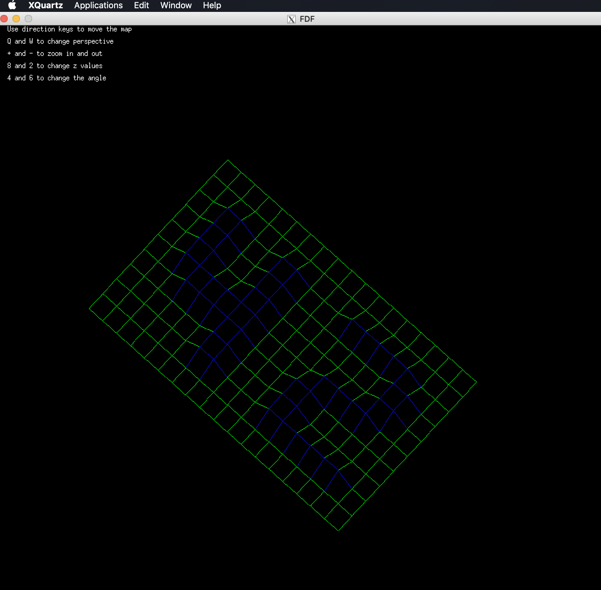

# FDF

This project is about creating a simplified graphic “wireframe” (“fils de fer” in french, hence the name of the project) representation of a relief landscape linking various points (x, y, z) via segments. The coordinates of this landscape are stored in a file passed as a parameter to your program.

# Input

The given input map is a 2D grid of numbers, where each number corresponds to its altitude.

For example, giving the following text as input:

```
0  0  0  0  0  0  0  0  0  0  0  0  0  0  0  0  0  0  0
0  0  0  0  0  0  0  0  0  0  0  0  0  0  0  0  0  0  0
0  0 10 10  0  0 10 10  0  0  0 10 10 10 10 10  0  0  0
0  0 10 10  0  0 10 10  0  0  0  0  0  0  0 10 10  0  0
0  0 10 10  0  0 10 10  0  0  0  0  0  0  0 10 10  0  0
0  0 10 10 10 10 10 10  0  0  0  0 10 10 10 10  0  0  0
0  0  0 10 10 10 10 10  0  0  0 10 10  0  0  0  0  0  0
0  0  0  0  0  0 10 10  0  0  0 10 10  0  0  0  0  0  0
0  0  0  0  0  0 10 10  0  0  0 10 10 10 10 10 10  0  0
0  0  0  0  0  0  0  0  0  0  0  0  0  0  0  0  0  0  0
0  0  0  0  0  0  0  0  0  0  0  0  0  0  0  0  0  0  0
```

Results in this visualization:


# Images



# Zoom in on different maps


Very good source for doing the project:
https://github.com/qst0/ft_libgfx#getting-started-with-fractol-ft_fractal
